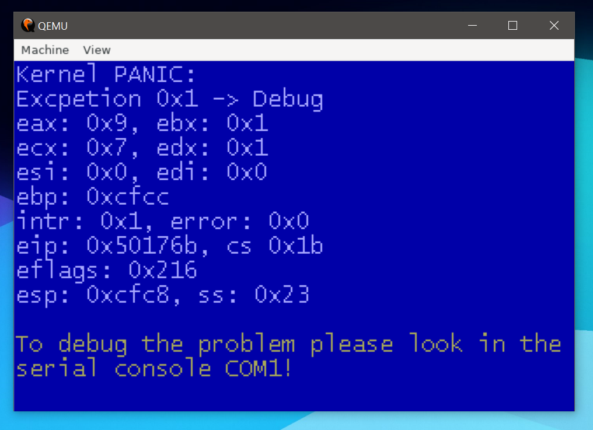

# Glowman554

## Friends

## Tools i use

## Programing languages i know

## Some information about me

### What are my interest's?

I love coding my own operating system. It can teach you a lot on how computers work internally.

 

Operating systems i made or im working on:  

- [NextOS](https://github.com/Glowman554/NextOS)
- [GOS](https://github.com/Glowman554/gos) / [GKernel](https://github.com/Glowman554/gkernel)
- [FoxOS](https://github.com/TheUltimateFoxOS/FoxOS)
- [MicroOS](https://github.com/Glowman554/MicroOS)

### Who am i?

Im janick aka Glowman554 and im 16 years old.

### Social media

- [Discord](https://discordapp.com/users/584344177257480192)
- [Instagram](https://www.instagram.com/glowman434/)

### GitHub stats

Fun fact:   

